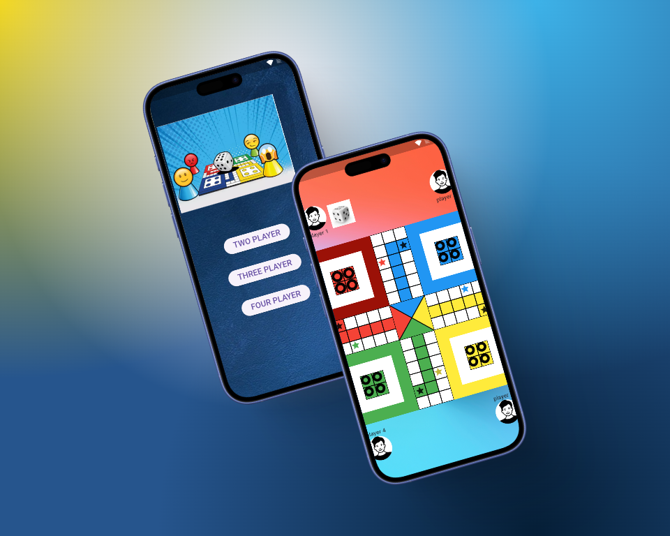
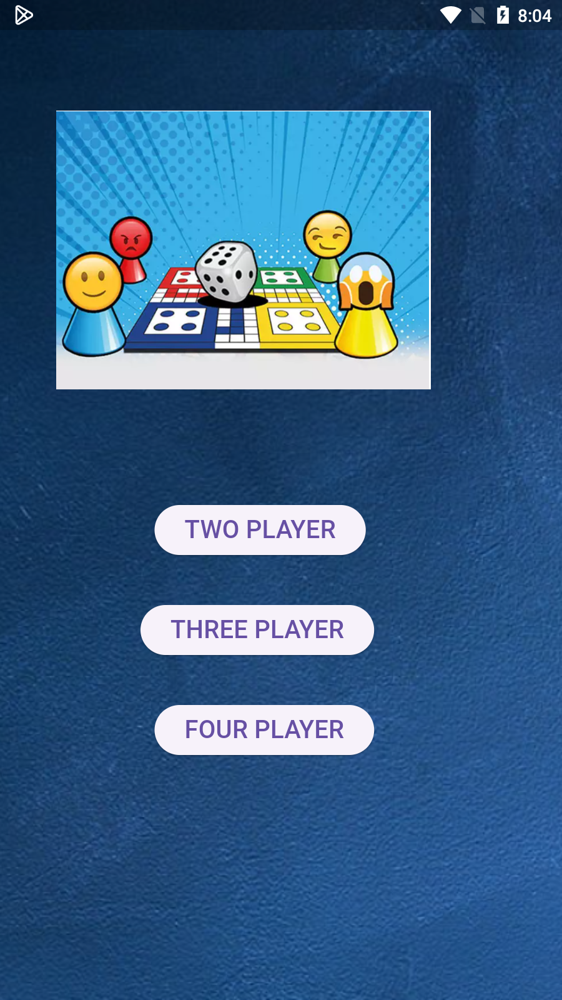
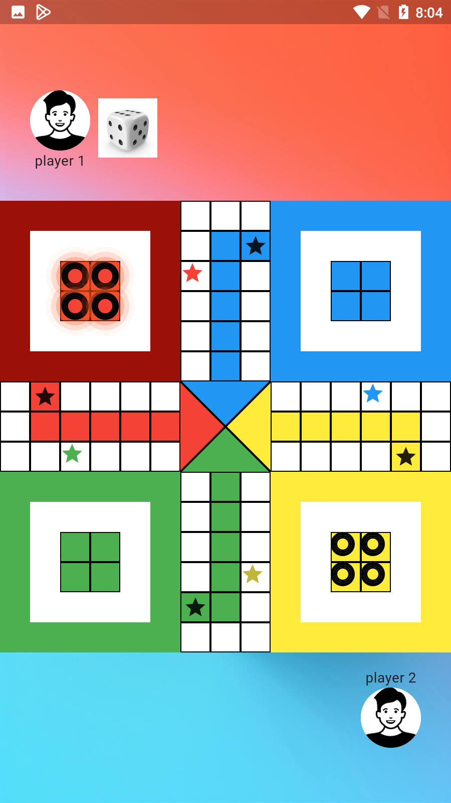
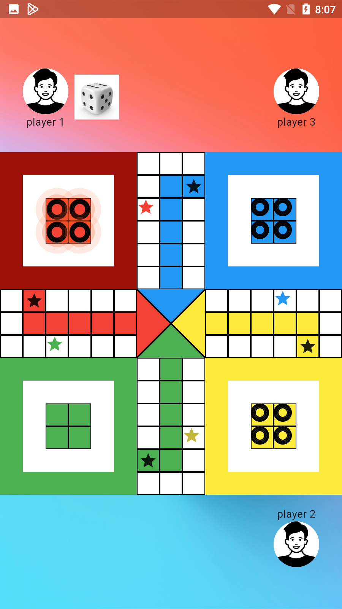
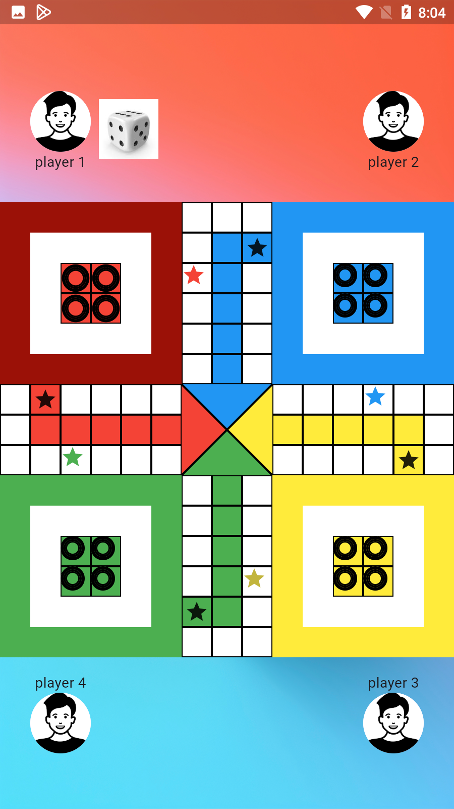
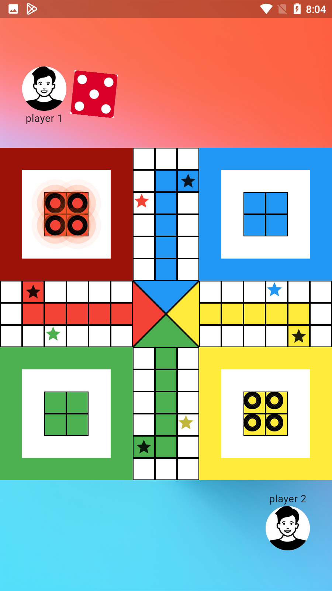
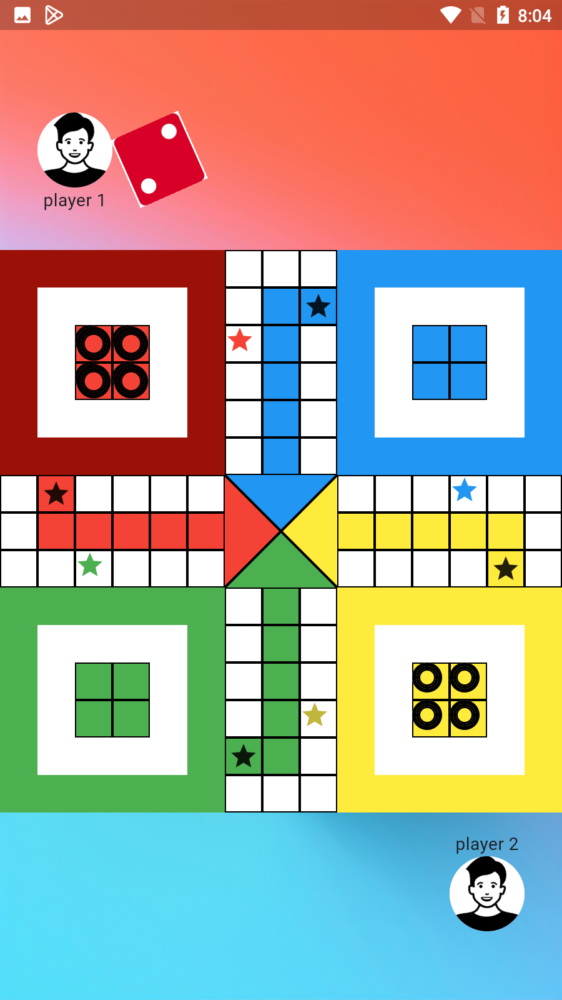

<div align="center">
  <h1>
    Ludo Flutter - Classic Board Game
  </h1>
  <p align="center">
    
  </p>
  <h3>A Modern Implementation of the Classic Ludo Game with Multiple Player Modes</h3>
</div>

<p align="center">
    
    
</p>

## 📌 Overview

A beautifully designed Flutter Ludo game that brings the classic board game to life with modern UI elements, smooth animations, and multiple player modes. The game features immersive sound effects and supports 2, 3, or 4 player gameplay.

## 🚀 Tech Stack

- **Flutter** (UI Framework)
- **Dart** (Programming Language)
- **AudioPlayers** (Sound Effects)
- **Custom Animations**
- **Material Design**

## 🔑 Key Features

- ✅ **Multiple Game Modes**: Choose between 2, 3, or 4 player modes
- ✅ **Sound Effects**: Immersive gaming experience with dice rolls and moves
- ✅ **Smooth Animations**: Fluid piece movements and dice rolls
- ✅ **Modern UI**: Clean and responsive interface
- ✅ **Game Rules**: Implements standard Ludo rules
- ✅ **Winner Detection**: Automatic winner detection and celebration

## 🎮 Game Features

### Sound Effects
- Dice rolling sounds
- Piece movement audio
- Victory/capture sounds
- Background effects

### Game Modes
1. **2 Player Mode**: Classic head-to-head gameplay
2. **3 Player Mode**: Triple threat matches
3. **4 Player Mode**: Full board experience

## 📸 Screenshots

### Welcome Screen
<p align="center">
  
</p>

### Game Modes

<table>
  <tr>
    <td align="center">
      
      <br />
      <b>2 Player Mode</b>
    </td>
    <td align="center">
      
      <br />
      <b>3 Player Mode</b>
    </td>
    <td align="center">
      
      <br />
      <b>4 Player Mode</b>
    </td>
  </tr>
</table>

### 2 Player Gameplay

<table>
  <tr>
    <td align="center">
      
      <br />
      <b>Game Progress</b>
    </td>
    <td align="center">
      
      <br />
      <b>Game Action</b>
    </td>
  </tr>
</table>

## 📁 Project Structure

```
lib/
├── screens/
│   ├── game_screen.dart
│   └── home_screen.dart
├── widgets/
│   └── ludo_board.dart
├── constants/
│   └── ludo_constants.dart
├── sound/
│   └── sound.dart
└── main.dart
```

## 🎲 Game Rules

1. Each player gets 4 pieces
2. Roll a 6 to move pieces out of home
3. Land on an opponent's piece to capture it
4. Get all pieces to the center to win
5. Three consecutive 6's forfeits the turn
6. Safe spots protect pieces from capture

## 🎯 How to Play

1. Select game mode (2, 3, or 4 players)
2. Roll dice by tapping the dice area
3. Select a piece to move
4. Follow standard Ludo rules
5. Get all pieces to the center to win!

## 🔧 Game Mechanics

### Movement Rules
- Pieces move clockwise around the board
- Must roll a 6 to leave home
- Exact roll needed to enter center
- Capture opponent pieces by landing on them

### Special Rules
- Rolling a 6 gives another turn
- Three 6's in a row forfeits turn
- Safe spots protect pieces
- Must have valid moves to continue

## 🎵 Sound Effects

The game includes the following sound effects:
- Move sound (`move.wav`)
- Dice rolling sound (`roll_the_dice.mp3`)
- Victory/capture sound (`laugh.mp3`)

## 🚀 Future Enhancements

- Online multiplayer support
- Player profiles and statistics
- Custom board themes
- Achievement system
- Game history tracking
- Tournament mode

## 🛠️ Installation

1. Clone the repository
2. Run `flutter pub get`
3. Run `flutter run`

## 🤝 Contributing

Contributions are welcome! Please feel free to submit a Pull Request.

## 📝 License

This project is licensed under the MIT License - see the LICENSE file for details. 